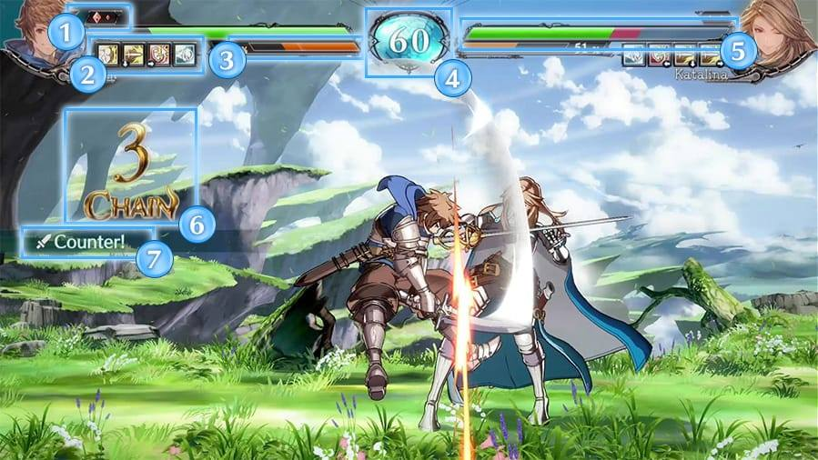
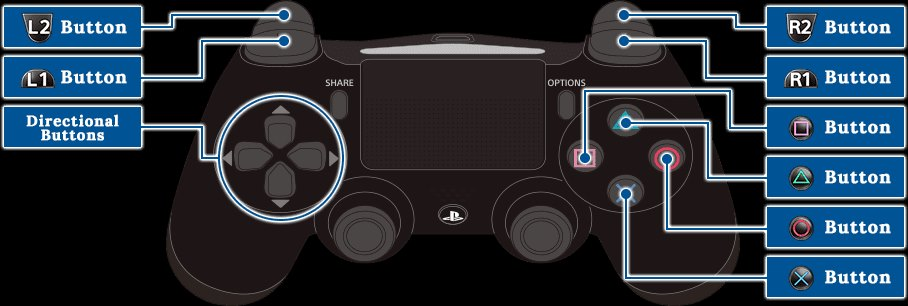
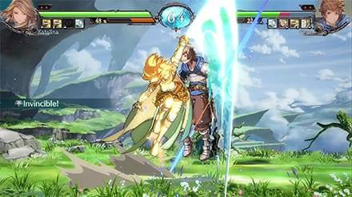
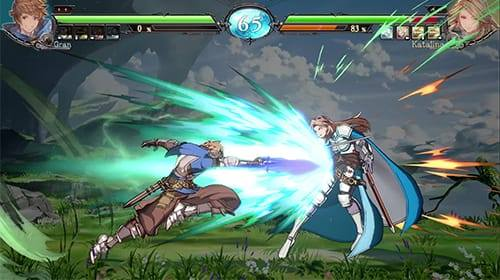
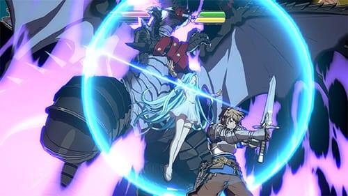

# Giao diện

1. Số hiệp đấu mà người chơi đã thắng
2. Các kỹ năng hiện có. Kỹ năng không khả dụng sẽ bị tối đi.
3. Thanh Sky Bound Art, sẽ tăng dần khi bạn nhận hoặc gây ra sát thương, hoặc
   một số hành động khác.
4. Thể hiện thời gian còn lại của hiệp đấu.
5. Thể hiện lượng máu bạn đang sở hữu
6. Thể hiện số đòn đánh được nối liên tục
7. Thể hiện các trạng thái đặc biệt như Counter, Parry, v.v

# Điều khiển cơ bản

- Các nút điều hướng: dùng để di chuyển, nhảy và đỡ.
- Nút vuông: đánh nhẹ (Light Attack), có ký hiệu nâng cao là L
- Nút vuông: đánh vừa (Medium Attack), có ký hiệu nâng cao là M
- Nút vuông: đánh mạnh (Heavy Attack), có ký hiệu nâng cao là H
- Nút vuông: hành động đặc trưng (Unique Action), có ký hiệu nâng cao là U
- Nút L1: để vật/chụp đối thủ, có thể dùng tổ hợp phím L+M hoặc L+U để thay
  thế.
- Nút L2: dùng để ra một đòn đánh từ trên đầu xuống. Đối thủ bắt buộc phải đỡ
  đứng. Tổ hợp phím thay thế là M+H.
- Nút R1: sử dụng kỹ năng, có ký hiệu nâng cao là S
- Nút R2: dùng để phòng thủ, có ký hiệu nâng cao là G.

## Tránh nhận sát thương

## Kỹ năng

Ấn S để sử dụng kỹ năng của nhân vật, mỗi nhân vật có 3 hoặc 4 kỹ năng được gán
vào nút S, sử dụng bằng cách ấn S, hoặc nút điều hướng + S (ví dụ: Lùi +S)

## Sky Bound Art - SBA

Thực hiện bằng cách ấn tổ hợp Xuống, Tới + S. Có thể sử dụng khi thanh SBA đầy.

## Super Sky Bound Art - SSBA

Thực hiện bằng cách ấn tổ hợp Xuống, Tới + S + U. Có thể sử dụng khi thanh SBA
đầy và máu của bạn ở dưới mức 30%.

## Sử dụng kỹ năng nâng cao

Ngoài cách sử dụng nút S, bạn có thể ra kỹ năng bằng các tổ hợp phím điều hướng
+ đòn đánh. Kỹ năng dùng theo cách này sẽ có thời gian hồi chiêu thấp hơn và
sát thương cao hơn. Để biết tổ  hợp của từng nhân vật, các bạn hãy vào Command
List trong game.
